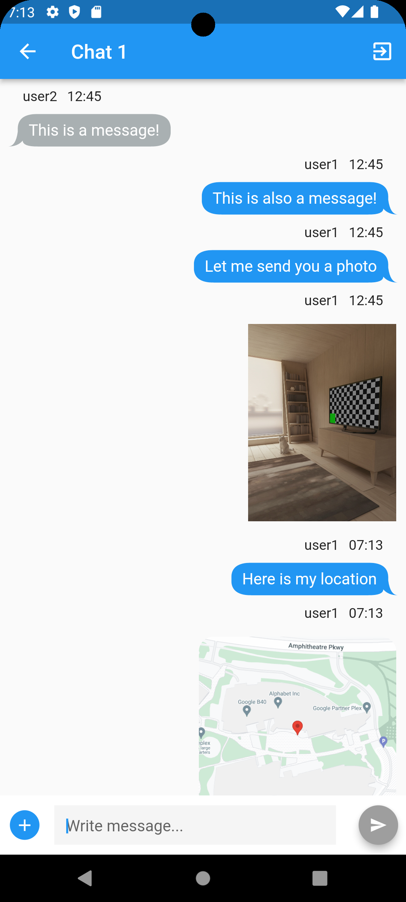

# ConversationalIST-Chat-App

Text chat Android app made with Flutter and Firebase. University project for the Mobile and Ubiquitous Computing course at Instituto Superior Técnico (2022). Uses Firebase Firestore, Firebase Storage, Firebase Cloud Messaging, Google Maps API, Firebase Authentication, and Firebase Cloud Functions.

## Features

- Create and login with user account
- Create three types of chat rooms:
  - Public: anyone can search and join
  - Private: only invited users can join
  - Georestricted: only users within a certain radius of a location can chat. If user goes outside the radius, chat is disabled
- Send and receive text messages
- Supports multiple users in the same chat room
- Supports sending files, camera images, and geographic locations in an embedded map
- Push notifications for new messages
- Localized in English and Portuguese
- Supports dark theme and landscape mode
- Caches messages and images for offline use and minimizing data usage
- Images load automatically only with Wifi, and can be manually loaded with mobile data

## Screenshots

    
    

    
    

    
    

    
    

## Requirements

- Flutter 3.7.0
- Google Maps API key
- Firebase project with Firestore, Authentication, Cloud Messaging and Cloud Functions

## Setup

0. Setup Firebase and the Cloud Functions. See the [cloud-functions](cloud-functions) directory for the Cloud Functions code. Deployment instructions available at <https://firebase.google.com/docs/functions/get-started>.
1. Create a .env file in the root directory based on the .env.example file.
2. Fill in the environment variables with your Firebase project credentials and Google Maps API key.
3. Add the google-services.json file to the android/app directory.
4. Add the Google Maps API key to the AndroidManifest.xml file in the android/app/src/main directory.
5. Run using Android Studio or Visual Studio Code with the Flutter extension.
